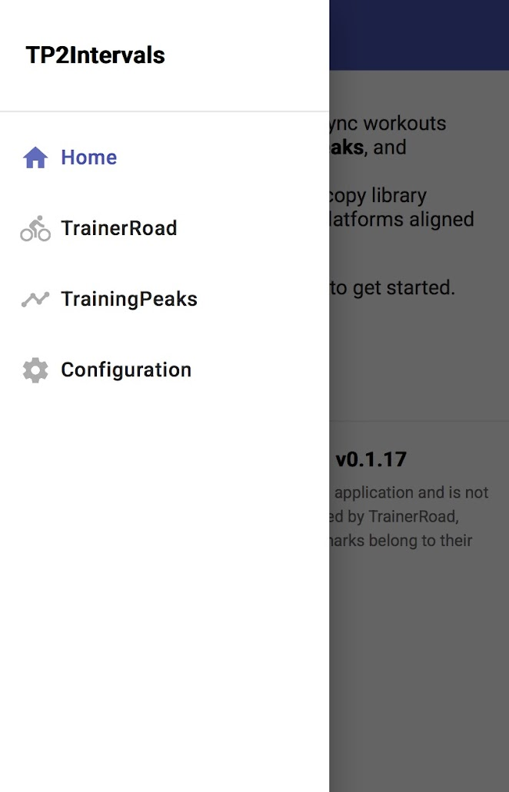
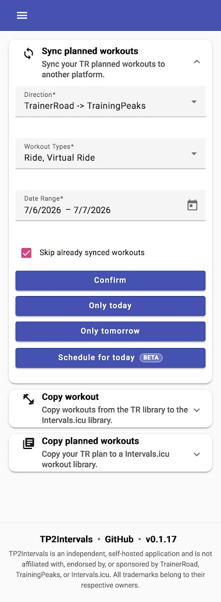

[](https://github.com/costa-alex/workout-relay/actions/workflows/docker.yml)
[](https://github.com/costa-alex/workout-relay/releases/latest)
[](LICENSE)

# Workout Relay

Workout Relay is a self-hosted web application for copying and synchronizing planned workouts between **TrainerRoad**, **TrainingPeaks**, and **Intervals.icu**.

It provides a responsive, mobile-friendly interface for manual synchronization, workout-library operations, recurring schedules, and synchronization history.

> This project is independent and is not affiliated with, endorsed by, or sponsored by TrainerRoad, TrainingPeaks, or Intervals.icu. All trademarks belong to their respective owners.

<p>
  
  
</p>

## Contents

- [Features](#features)
- [Supported synchronization directions](#supported-synchronization-directions)
- [Scheduler and history](#scheduler-and-history)
- [Settings](#settings)
- [Running with Docker Compose](#running-with-docker-compose)
- [Updating](#updating)
- [Building from source](#building-from-source)
- [Data, backups, and logs](#data-backups-and-logs)
- [Security considerations](#security-considerations)
- [Known limitations](#known-limitations)
- [Troubleshooting](#troubleshooting)
- [Project background](#project-background)
- [License](#license)

## Features

### Calendar synchronization

- Copy planned workouts between supported platform calendars.
- Select a custom date range.
- Use quick actions for **Only today** and **Only tomorrow**.
- Filter by workout type, including ride, virtual ride, MTB, run, swim, walk, weight training, and other activities.
- Skip workouts that were already synchronized by comparing platform identifiers.
- Continue processing a batch when an individual workout fails, while reporting the failed items.
- Preserve relevant workout metadata where supported, including workout structure, duration, load, and external platform identifiers.

### TrainerRoad to TrainingPeaks reconciliation

For selected TrainerRoad → TrainingPeaks operations, Workout Relay can reconcile changed planned workouts instead of only adding another copy.

This behavior is used by:

- **Only today**;
- **Only tomorrow**;
- scheduled TrainerRoad → TrainingPeaks synchronization, including multi-day rolling periods.

Scheduled periods that span more than one day are reconciled independently, one day at a time. This preserves the same safety rules for every date in the configured period.

When the TrainerRoad workout identifier changes, Workout Relay:

1. creates the new workout in TrainingPeaks;
2. confirms that the creation succeeded;
3. removes the previous application-managed TrainingPeaks workout.

Only workouts previously created by Workout Relay, with the expected external identifiers and metadata marker, are eligible for removal. Manually created TrainingPeaks workouts are not removed by this reconciliation process.

The regular **Confirm** action for a custom date range uses normal copy behavior and does not remove replaced workouts.

### Workout libraries and training plans

The application also supports operations beyond calendar-to-calendar synchronization:

- Copy a workout from the TrainerRoad workout library to an Intervals.icu library.
- Copy planned TrainerRoad workouts into a new Intervals.icu workout folder or training plan.
- Copy a TrainingPeaks training plan or workout library to Intervals.icu.
- Copy planned TrainingPeaks calendar workouts into an Intervals.icu workout library.

Some TrainingPeaks operations depend on whether the configured account is an athlete or coach account.

### User interface

- Responsive Angular Material interface designed for desktop and mobile use.
- Home page with platform connection status and available synchronization routes.
- Platform-specific pages for TrainerRoad and TrainingPeaks operations.
- Dedicated **Sync Center** page.
- In-app result notifications with copied, skipped, replaced, and failed workout counts.
- Version display and release-update indication.
- Debug mode for detailed troubleshooting logs.

## Supported synchronization directions

| Source | Destination | Manual calendar sync | Scheduled sync | Changed-workout reconciliation |
|---|---|:---:|:---:|:---:|
| TrainerRoad | TrainingPeaks | Yes | Yes | Yes, for quick one-day actions and scheduled ranges |
| TrainerRoad | Intervals.icu | Yes | Yes | No |
| TrainingPeaks | Intervals.icu | Yes | Yes | No |
| Intervals.icu | TrainingPeaks | Yes | Yes | No |

TrainerRoad is currently a source platform only. TrainingPeaks → TrainerRoad and Intervals.icu → TrainerRoad are not supported.

## Scheduler and history

The **Sync Center** page allows you to create recurring calendar synchronization jobs for any supported direction.

Current scheduler behavior:

- each schedule uses a configurable rolling period relative to the execution date;
- offsets from `-1` to `7` days are supported;
- existing schedules without an explicit period continue to process the current day;
- all schedules use the global scheduler interval, which defaults to **1 hour**;
- schedules are persisted in SQLite and survive container restarts;
- duplicate schedule definitions are rejected;
- each schedule can be executed immediately with **Run now**;
- schedules can be deleted without deleting previously synchronized workouts.

TrainerRoad → TrainingPeaks schedules automatically use the safe changed-workout reconciliation described above. Multi-day periods are reconciled one day at a time. Other directions use normal synchronization with the configured duplicate-skipping behavior.

Examples of rolling periods:

| Start offset | End offset | Period processed on every run |
|---:|---:|---|
| `0` | `0` | Today |
| `0` | `1` | Today and tomorrow |
| `0` | `6` | Today and the following six days |
| `-1` | `1` | Yesterday, today, and tomorrow |
| `1` | `7` | Tomorrow through seven days from today |

### Synchronization history

Calendar-to-calendar executions are stored and displayed on the Sync Center page. The history includes:

- manual operations;
- scheduled executions;
- **Run now** executions;
- source and destination platforms;
- processed date range;
- copied, removed, skipped, and failed counts;
- execution status;
- available error details.

Possible statuses are:

- `RUNNING`
- `SUCCESS`
- `NO_CHANGES`
- `PARTIAL_SUCCESS`
- `FAILED`
- `INTERRUPTED`

The interface displays up to the configured SYNC_HISTORY_RETENTION_LIMIT value, which defaults to 100. Calendar-to-library and library-to-library operations are not currently included in synchronization history.

## Settings

Open **Settings** after starting the application. Intervals.icu credentials are required; TrainingPeaks and TrainerRoad are optional and are only needed for their corresponding features.

The **General** section offers System, Light, and Dark appearance modes. System follows the operating-system preference, while an explicit choice is stored in the current browser.

Platform settings, schedules, and execution history are stored in the SQLite database under `/data`.

### Intervals.icu

In Intervals.icu, open **Settings** and locate the **Developer Settings** section.

Configure:

- **API Key**
- **Athlete ID**, usually in a format such as `i12345`

Advanced settings are also available for power, heart-rate, and pace range percentages used when converting workout targets.

### TrainingPeaks

The TrainingPeaks integration currently uses an authenticated browser-session cookie rather than OAuth.

Required cookie:

```text
Production_tpAuth=<value>
```

To obtain it:

1. Sign in to TrainingPeaks in your browser.
2. Open the browser developer tools and select the **Network** tab.
3. Reload TrainingPeaks or open a calendar page.
4. Select an authenticated request to `tpapi.trainingpeaks.com`.
5. Copy the request's `Cookie` header or the `Production_tpAuth` cookie value.
6. Paste it into the Workout Relay Settings page.

The application accepts the complete cookie string and extracts the required value.

See [`docs/tp_guide.png`](docs/tp_guide.png) for a visual guide.

### TrainerRoad

The TrainerRoad integration also uses an authenticated browser-session cookie.

Required cookie:

```text
SharedTrainerRoadAuth=<value>
```

To obtain it:

1. Sign in to TrainerRoad in your browser.
2. Open the browser developer tools and select the **Network** tab.
3. Reload the page or open the TrainerRoad calendar or workout library.
4. Select an authenticated request to `www.trainerroad.com`.
5. Copy the request's `Cookie` header or the `SharedTrainerRoadAuth` cookie value.
6. Paste it into the Workout Relay Settings page.

The **Remove HTML tags from description** option can be enabled if TrainerRoad descriptions contain unwanted markup.

See [`docs/tr_guide.png`](docs/tr_guide.png) for a visual guide.

> Browser-session cookies can expire. If a platform suddenly becomes unavailable, obtain a fresh cookie and update the configuration.

## Running with Docker Compose

The published container image is:

```text
ghcr.io/costa-alex/workout-relay:latest
```

Create a directory for the application:

```bash
mkdir -p workout-relay/data
cd workout-relay
```

Create `docker-compose.yml`:

```yaml
services:
  workout-relay:
    image: ghcr.io/costa-alex/workout-relay:latest
    container_name: workout-relay
    restart: unless-stopped
    environment:
      # Replace with your local IANA timezone.
      JAVA_TOOL_OPTIONS: "-Duser.timezone=Europe/Lisbon"
      # Global interval for all scheduled syncs. Accepted values: 1-24 hours.
      SCHEDULER_INTERVAL_HOURS: "${SCHEDULER_INTERVAL_HOURS:-1}"
      # Maximum number of synchronization executions retained in history.
      SYNC_HISTORY_RETENTION_LIMIT: "100"
    ports:
      - "8098:8080"
    volumes:
      - ./data:/data
```

`SCHEDULER_INTERVAL_HOURS` is read when the application starts. It accepts whole hours from `1` to `24`, applies to every scheduled sync in the instance, and defaults to `1`. Recreate the container after changing it.
`SYNC_HISTORY_RETENTION_LIMIT` is the maximum number of scheduler executions retained in history.

Start the application:

```bash
docker compose up -d
```

Open:

```text
http://<server-address>:8098
```

Then open **Settings**, enter the credentials for the platforms you use, and save them.

### Using a fixed release

For a more predictable deployment, replace `latest` with a release tag:

```yaml
image: ghcr.io/costa-alex/workout-relay:<version>
```

This Compose definition can also be deployed through tools such as Komodo, Portainer, or another Docker-compatible orchestrator.

### Health endpoint

Spring Boot Actuator exposes a health endpoint at:

```text
http://<server-address>:8098/actuator/health
```

## Updating

Pull the newest image and recreate the container:

```bash
docker compose pull
docker compose up -d
```

Review the logs after updating:

```bash
docker compose logs -f --tail=200 workout-relay
```

Database schema updates are applied automatically by Liquibase when the application starts.

## Building from source

### Build the complete Docker image

From the repository root:

```bash
docker build -t workout-relay:local .
```

Run it:

```bash
docker run --rm \
  --name workout-relay \
  -p 8098:8080 \
  -e JAVA_TOOL_OPTIONS="-Duser.timezone=Europe/Lisbon" \
  -e SCHEDULER_INTERVAL_HOURS=1 \
  -e SYNC_HISTORY_RETENTION_LIMIT=100 \
  -v "$(pwd)/data:/data" \
  workout-relay:local
```

The multi-stage Docker build:

1. builds the Angular UI with Node.js 20;
2. copies the UI into the Spring Boot resources;
3. builds the Kotlin application with Java 21;
4. produces a single runtime container exposing port `8080`.

### Local development

Requirements:

- Java 21
- Node.js 20
- npm

Start the backend from the repository root:

```bash
mkdir -p data
cd boot

SPRING_DATASOURCE_URL="jdbc:sqlite:../data/workout-relay.sqlite" \
LOGGING_FILE_NAME="../data/workout-relay.log" \
SCHEDULER_INTERVAL_HOURS=1 \
./gradlew bootRun
```

In another terminal, start the Angular development server:

```bash
cd ui
npm ci
npm run dev
```

Open:

```text
http://localhost:4200
```

The Angular development server proxies `/api` and `/actuator` requests to the backend at `http://localhost:8080`.

### Run tests and builds

Backend:

```bash
cd boot
./gradlew test
./gradlew bootJar
```

Frontend:

```bash
cd ui
npm ci
npm run build
npm test
```

## Data, backups, and logs

The `/data` directory contains the persistent application state:

```text
/data/workout-relay.sqlite
/data/workout-relay.log
```

The SQLite database contains platform configuration, schedules, and synchronization history. Protect it because it may contain authentication cookies.

### Backup

Stop the container before copying the SQLite database:

```bash
docker compose stop workout-relay
cp data/workout-relay.sqlite \
  "data/workout-relay.sqlite.backup-$(date +%Y%m%d-%H%M%S)"
docker compose start workout-relay
```

Back up the complete data directory if preferred:

```bash
tar -czf "workout-relay-data-$(date +%Y%m%d-%H%M%S).tar.gz" data/
```

### Logs

Follow container output:

```bash
docker compose logs -f --tail=200 workout-relay
```

Read the persistent application log:

```bash
tail -f data/workout-relay.log
```

Enable **Debug Mode** on the Settings page when additional request and integration details are needed. Disable it again after troubleshooting because debug logs can be verbose and may include sensitive platform information.

## Security considerations

Workout Relay is intended for self-hosted, trusted environments.

- The application does not currently provide built-in user authentication.
- Do not expose it directly to the public Internet without an authenticated reverse proxy, VPN, or access-control layer.
- Restrict access to the `/data` directory and its backups.
- Never commit platform cookies, the SQLite database, logs, or HAR files to Git.
- Treat TrainingPeaks and TrainerRoad cookies as account credentials.
- Use HTTPS when accessing the application across an untrusted network.

The TrainingPeaks and TrainerRoad integrations depend on web endpoints and session cookies that may change without notice.

## Known limitations

- TrainerRoad ramp steps are not currently supported.
- TrainerRoad is supported as a source, not as a synchronization destination.
- Changed-workout replacement is available for **Only today**, **Only tomorrow**, and scheduled TrainerRoad → TrainingPeaks rolling periods. The regular manual **Confirm** action still uses non-destructive copy behavior.
- Changed-workout detection is primarily based on the TrainerRoad workout identifier. A content change that keeps the same identifier may be treated as already synchronized.
- Scheduler periods are relative to the execution date and are limited to offsets between `-1` and `7` days.
- The scheduler interval is global for the application instance and cannot be configured per schedule.
- Synchronization history currently covers calendar-to-calendar operations only.
- TrainingPeaks capabilities can differ between athlete, coach, free, and Premium accounts.

### TrainingPeaks future dates

TrainingPeaks free accounts may restrict planning workouts on future dates. Workout Relay displays a warning when synchronizing beyond the near-term date range. A TrainingPeaks Premium account may be required for longer future ranges.

## Troubleshooting

### A platform is shown as disconnected

1. Open **Settings**.
2. Obtain a new API key or authentication cookie.
3. Save the configuration again.
4. Check the application logs for the platform-specific error.

### A synchronization reports partial success or failure

Open **Sync Center → Sync history** to review:

- the execution status;
- copied and removed counts;
- failed workout counts;
- the available error message.

Batch synchronization continues after individual workout failures, so some workouts may still be copied successfully.

### Scheduler uses the wrong day or the history time is incorrect

Set the JVM timezone explicitly in Docker Compose:

```yaml
environment:
  JAVA_TOOL_OPTIONS: "-Duser.timezone=Europe/Lisbon"
```

Replace `Europe/Lisbon` with your local [IANA timezone](https://en.wikipedia.org/wiki/List_of_tz_database_time_zones).

### Inspect the SQLite database

Install the SQLite command-line client on the Docker host and inspect the database while the application is stopped:

```bash
docker compose stop workout-relay
sqlite3 data/workout-relay.sqlite ".tables"
docker compose start workout-relay
```

Always create a backup before changing database contents manually.

### Record a HAR file

A HAR file can help diagnose changes in TrainerRoad or TrainingPeaks requests:

1. Open the platform in a new browser tab.
2. Open Developer Tools → **Network**.
3. Enable **Preserve log**.
4. Reproduce the relevant platform action.
5. Export the network log as a HAR file.

See [`docs/har-1.png`](docs/har-1.png) and [`docs/har-2.png`](docs/har-2.png).

> HAR files can contain session cookies and personal data. Never attach them to a public issue without sanitizing them first.

## Project background

This repository is a fork of [Litwilly/tp2intervals](https://github.com/Litwilly/tp2intervals), which is itself based on the original project by [freekode/tp2intervals](https://github.com/freekode/tp2intervals).

This fork places additional emphasis on TrainerRoad → TrainingPeaks synchronization, including mobile usability, changed-workout reconciliation, persisted automation, and execution history.

Additional discussion about the original project and workout conversion behavior is available in the [Intervals.icu forum thread](https://forum.intervals.icu/t/tp2intervals-copy-trainingpeaks-and-trainerroad-workouts-plans-to-intervals/63375).

## Technology stack

- Angular 17 and Angular Material
- Kotlin 1.9
- Spring Boot 3.2
- Java 21
- Spring Data JPA and OpenFeign
- SQLite
- Liquibase
- Docker

## License

Workout Relay is distributed under the [GNU General Public License v3.0](LICENSE).
